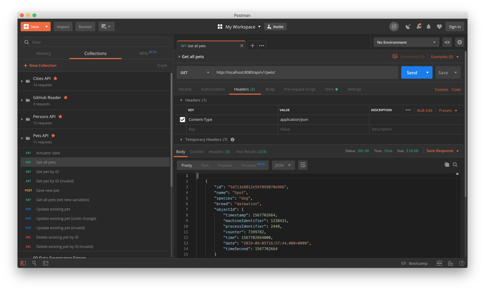

# Pets API
[](https://circleci.com/gh/Carla-de-Beer/pets-api)

This is a Spring Boot API project that displays data related to a list of pets. This data is manipulated by means of a set of standard and custom CRUD calls via a MongoDB database. 

The project is written in Java 11 and uses Maven as build tool. Unit and integration tests are written with JUnit 5 and Mockito. Functional tests are provided by means of the Postman platform.

Continuous integration is achieved through [CircleCi 2.0](https://circleci.com/docs/2.0/).

## Requirements

* Java 11
* Spring Boot 2.2.1
* Maven 3.6.1
* MongoDB 4.2.1
* JUnit 5

## Getting started

* Fork or clone the project.
* The MongoDB database is populated with initial data read in via the `Bootstrap` class. Alternatively, manually add data to the database via te efollowing commands:

`use pet_store;`

`db.createCollection("pet");`

```
db.pet.insertMany([
  {
    "name" : "Fluffy",
    "species" : "cat",
    "breed" : "siamese"
  },
  {
    "name" : "Henry",
    "species" : "tortoise",
    "breed" : "leopard tortoise"
  }
])
```

* Add a database username and password to the `src/main/resources/application.properties` file.
* Start the project server by running the command `mvn spring-boot:run`.

The API can be called with any of the following cURL CRUD-based requests:

* GET/READ:
  * ```curl -i http://localhost:8080/api/v1/pets/```
  * ```curl -i http://localhost:8080/api/v1/pets/<ObjectId>```
  * ```curl -i http://localhost:8080/api/v1/name/<String>```
  * ```curl -i http://localhost:8080/api/v1/species/<String>```
  * ```curl -i http://localhost:8080/api/v1/breed/<String>```


* UPDATE/EDIT:
  * ```curl -i -H "Content-Type: application/json" -X PUT -d '{  "name" : "Spot","species" : "dog","breed" : "terrier"}' http://localhost:8080/api/v1/pets/<ObjectId>```


* CREATE/ADD:
  * ```curl -i -H "Content-Type: application/json" -X POST -d '{  "name" : "Cocky","species" : "bird","breed" : "cockatoo"}' http://localhost:8080/api/v1/pets/```


* DELETE:
  * ```curl -i -X DELETE http://localhost:8080/api/v1/pets/<ObjectId>```
  
  Alternatively, import and run the Postman test collection. These can be found under `src/test/resources/postman/Pets\ API.postman_collection.json`.

<p align="center">
  
</p>
